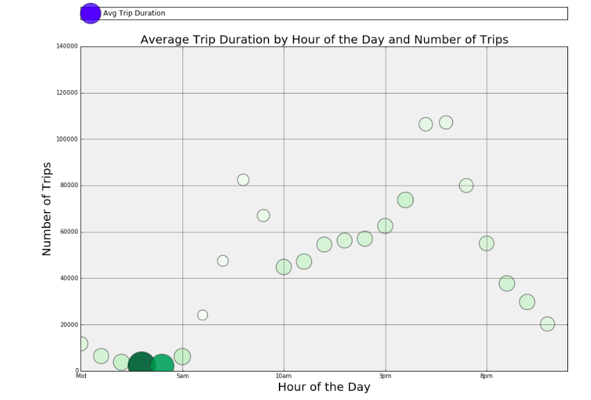

###Review 

1. Clarity: Overall, the graph looks quite clear. All the axis have labels and the graph has a clear title. Looking at the graph, I can easily read the data. However, it is confusing to me why the circles have different sizes and colors. Besides, the supposedly legend ("avg trip duration") should not be at the top of the graph, above the title of the graph like that. 

2. Esthetic: The size of the numbers is too small to read. 

3. Honesty: The graph well presents the data. 

4. Suggestions: elaborate more on how the size of each circle presents avg trip duration (seconds, minutes?) and make all numbers slightly bigger. 
