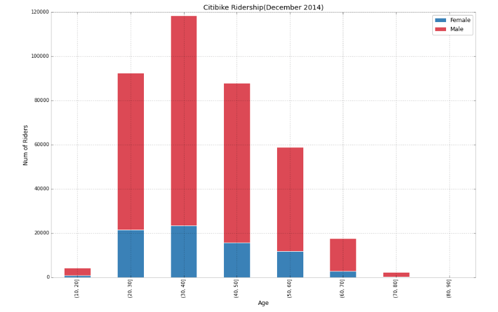

###Review 

1. Clarity: Overall, the plot is clear and easy to understand. The stacked bar plot does a good job of demonstrating the total numbers of riders in each age group.

2. Esthetic: There is a clear distinction in colors between female and male riders. The graph has all the labels in each axis as well, telling the reader what the graph is about. However, the size of those labels should be slight bigger since they do not look proportionally to the size of the graph now. 

3. Honesty: The graph well presents the data. 

4. Suggestions: change the size of the labels in each axis, change the title so that it is less vague. 